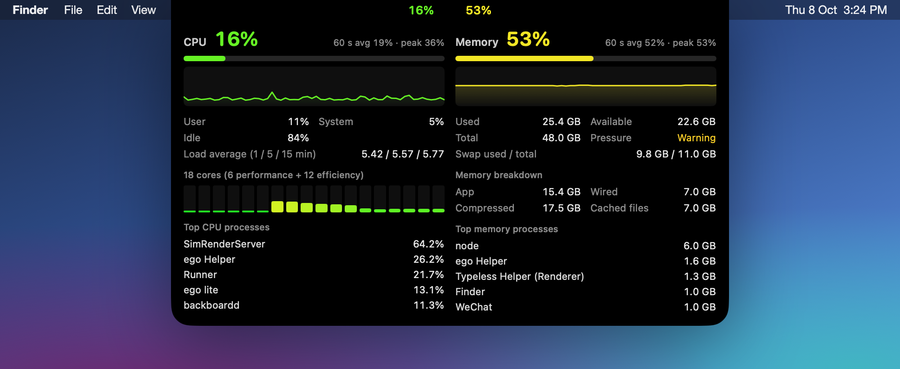

# CPU Memory Monitor

A tiny macOS app that puts live CPU and memory usage right next to the notch. Hover over it and a detailed panel drops down.


▶ [Watch the 10-second promo with sound (MP4)](docs/demo.mp4)

## Features



- **Always visible, never in the way.** Two colour-coded percentages sit either side of the notch (or the top centre of the menu bar on screens without one). They go from green through yellow to red as usage climbs.
- **Hover for details.** A wider panel springs open while the pointer is over the island and closes when it leaves:
  - **CPU:** user / system / idle split, 1 / 5 / 15-minute load averages, a bar for every core (performance and efficiency cores are counted separately), and the top 5 processes by CPU.
  - **Memory:** used / available / total, memory pressure, swap, the same breakdown as Activity Monitor (app, wired, compressed, cached files), and the top 5 processes by memory.
  - A 60-second sparkline for each, with its average and peak.
- **Light on resources.** It samples once a second, only reads per-process data while the panel is open, and stops sampling completely while the display is asleep or another user is logged in.
- **No Dock icon.** It lives in a small menu bar item with *Launch at Login* and *Quit*.


## Requirements

- macOS 14 Sonoma or later
- Apple Silicon Mac (the prebuilt release is arm64; you can build from source for other targets)

## Install

1. Download `CPUMemoryMonitor.dmg` from the [latest release](../../releases/latest).
2. Open it and drag **CPUMemoryMonitor** into **Applications**.
3. The app is ad-hoc signed, not notarised, so macOS will block it the first time. Either:
   - open **System Settings → Privacy & Security** and click **Open Anyway**, or
   - run `xattr -dr com.apple.quarantine /Applications/CPUMemoryMonitor.app` in Terminal.

To start it automatically, click the gauge icon in the menu bar and turn on **Launch at Login**.

## Build from source

You need Xcode 15 or later (or the matching Swift 5.9+ command line tools).

```sh
git clone https://github.com/Tony1986111/CPU_memory_monitor.git
cd CPU_memory_monitor

swift run            # build and run a debug copy
./build.sh           # release build → build/CPUMemoryMonitor.app and build/CPUMemoryMonitor.dmg
```

## How it works

| File | What it does |
|---|---|
| `Sources/App.swift` | App entry point, menu bar item, launch-at-login, pausing while the screen sleeps |
| `Sources/SystemMonitor.swift` | Samples CPU ticks (`host_processor_info`), memory (`host_statistics64`, `kern.memorystatus_level`), swap and pressure once a second |
| `Sources/ProcessSampler.swift` | Per-process CPU and memory via `proc_pid_rusage` |
| `Sources/NotchWindow.swift` | Borderless panel around the notch, sized to the island, with hover tracking |
| `Sources/IslandView.swift` | SwiftUI view for the collapsed wings and the details panel |

"Memory used" is `1 − kern.memorystatus_level`, the same available-memory figure that drives Activity Monitor's memory pressure graph. Processes owned by other users (such as root daemons) can't be read without root and are skipped.
